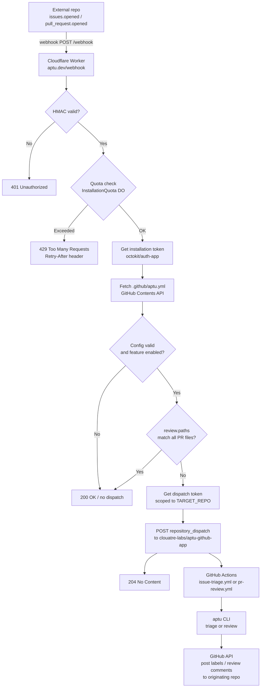
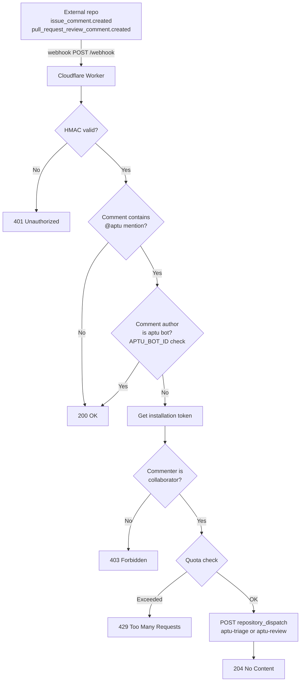

# Architecture

## Overview

aptu-github-app is a hosted automation service that brings AI-assisted issue triage and PR
review to any GitHub repository. It consists of two components that live in this repository:
a stateless Cloudflare Worker that receives GitHub webhooks and dispatches events, and a pair
of GitHub Actions workflows that consume those events and invoke the aptu CLI.

External repositories never run workflows themselves. They install the GitHub App, add a
`.github/aptu.yml` opt-in config, and all processing happens centrally here.

## Components

### Cloudflare Worker (`worker/src/index.ts`)

Deployed to `aptu.dev/webhook`. Receives every GitHub webhook event delivered by the App
installation. Responsibilities:

- Validate the `X-Hub-Signature-256` HMAC signature using the Web Crypto API
- Enforce per-installation quota via the `InstallationQuota` Durable Object (50 events per
  event type per 24-hour rolling window; responds 429 with `Retry-After` on excess)
- Obtain a scoped installation token via `@octokit/auth-app` for the originating repository
- Fetch and validate `.github/aptu.yml` from the originating repository (5-second timeout;
  no dispatch if absent or invalid)
- Check the `ALLOWED_OWNERS` allowlist -- hard 403 gate on repository.owner.login
- Evaluate `review.paths` globs (picomatch) against PR file lists; suppress dispatch if no
  file qualifies
- Obtain a scoped dispatch token for `TARGET_REPO`
- POST a `repository_dispatch` event to `TARGET_REPO`, carrying all context in
  `client_payload`
- Return 200/204 to GitHub immediately; all processing is fire-and-forget after dispatch

The Worker is stateless beyond the Durable Object quota store. It never calls the aptu CLI
and has no knowledge of AI providers.

### GitHub Actions Workflows

Two workflows in `.github/workflows/` listen for `repository_dispatch` events fired by the
Worker and run the aptu CLI against the originating repository.

| Workflow | Trigger event type | aptu command |
|---|---|---|
| `issue-triage.yml` | `aptu-triage` | `aptu issue triage` |
| `pr-review.yml` | `aptu-review` | `aptu pr review` |

Both workflows run in this repository (`clouatre-labs/aptu-github-app`), not in the
originating repository. The originating repo, PR or issue number, and a scoped installation
token all arrive via `github.event.client_payload`. The aptu CLI uses that token to read the
originating repo and post review comments or labels back to it.

### `InstallationQuota` Durable Object (`worker/src/quota.ts`)

Persists per-installation event counters using Cloudflare Durable Object SQLite-backed
storage. Each counter is keyed by `quota:{installationId}:{eventType}`. On every request,
timestamps older than 24 hours are pruned. At 50 events within the rolling window the Durable
Object returns `exceeded: true` and a `retryAfter` value in seconds.

### `GlobalQuota` Durable Object (`worker/src/quota.ts`)

Persists an org-wide aggregate event counter using a single well-known Durable Object
instance (`idFromName('global')`). The limit is passed in the Request body (the DO has no
`env` access) and is coerced from `GLOBAL_QUOTA_LIMIT` with a default of 500/day. The
counter uses the same rolling 24-hour window and pruning logic as `InstallationQuota`.

### Config Parser (`worker/src/config.ts`)

`fetchRepoConfig` fetches `.github/aptu.yml` from the originating repository via the GitHub
Contents API and decodes the base64 response. `parseConfig` validates the YAML strictly: all
required fields must be present and correctly typed; unknown fields are ignored; a partial or
empty `ai` block causes the entire config to be rejected. `shouldDispatch` checks whether the
resolved config enables the requested feature (`triage` or `review`).

## Data Flow

### Automatic triage and review (webhook trigger)



### Mention command trigger (`@aptu` in comments)



## Token Model

Two distinct tokens are used per webhook event. Both are short-lived installation tokens
issued by the GitHub App via `@octokit/auth-app`.

| Token | Scope | Purpose |
|---|---|---|
| Installation token | Originating repository | Read repo contents, fetch `.github/aptu.yml`, fetch PR file list, post review comments and labels back |
| Dispatch token | `TARGET_REPO` only | Call `POST /repos/clouatre-labs/aptu-github-app/dispatches` |

The installation token is passed to the workflow via `client_payload.installation_token` and
used by the aptu CLI to authenticate against the originating repository. The Worker never
stores either token.

## Configuration

### Worker environment (`wrangler.toml`)

| Variable | Type | Description |
|---|---|---|
| `APP_ID` | var | GitHub App numeric ID |
| `TARGET_REPO` | var | `owner/repo` that receives `repository_dispatch` events |
| `ALLOWED_OWNERS` | var | Comma-separated GitHub account/org names permitted to use the app; any other owner is rejected with 403 before any dispatch |
| `APTU_BOT_ID` | var | GitHub numeric user ID of the `aptu[bot]` account; gates the self-mention loop guard |
| `WEBHOOK_SECRET` | secret | HMAC key matching the GitHub App webhook secret |
| `APP_PRIVATE_KEY` | secret | PKCS#8 PEM private key for the GitHub App |
| `QUOTA` | Durable Object binding | `InstallationQuota` namespace |
| `GLOBAL_QUOTA` | Durable Object binding | `GlobalQuota` namespace |
| `GLOBAL_QUOTA_LIMIT` | var | Org-wide dispatch ceiling per rolling 24h (default `500`) |

### Repository opt-in (`.github/aptu.yml`)

Each originating repository opts in by adding `.github/aptu.yml`. The Worker fetches this
file on every event; no dispatch occurs if it is absent or fails validation.

```yaml
version: 1

triage:
  enabled: true

review:
  enabled: true
  instructions-file: .github/instructions/pr-review.md  # optional
  skip-labeled: false                                     # optional
  paths:                                          # optional; suppress PR review when no file qualifies
    - "src/**"                                    # bare patterns are includes
    - "!src/data/**"                              # '!'-prefixed patterns are excludes

ai:                          # required
```

`ai.api-key-secret` is the name of a GitHub Actions secret in the originating repository.
The Worker never has access to repository secrets. The workflow resolves the key at runtime
via `${{ secrets[github.event.client_payload.ai_key_secret] }}`.

## Caller-Supplied AI Keys

All repositories must include an explicit `ai` block with `api-key-secret` pointing to their
chosen secret name. The `api-key-secret` value names a secret in the caller's own repository.
The dispatch payload carries the secret name (`ai_key_secret`), not the secret value. The
workflow uses it as a dynamic secret reference; the key is never exposed to the Worker or
logged.

## Security Boundaries

| Boundary | Mechanism |
|---|---|
| Webhook authenticity | HMAC-SHA256 via Web Crypto API; `WEBHOOK_SECRET` never leaves the Worker |
| Token isolation | Installation tokens are scoped per-repo; dispatch tokens are scoped to `TARGET_REPO` only |
| Quota enforcement | Durable Object per installation; 50 events per event type per 24h rolling window |
| Caller AI keys | Secret name only crosses the boundary; value resolved inside GitHub Actions |
| Config validation | Strict field-level validation; unknown keys ignored; partial blocks rejected |
| Self-mention loop | `APTU_BOT_ID` check prevents the bot from triggering itself via `@aptu` |
| Path filtering | `review.paths` evaluated against full PR file list before dispatch |

## Key Abstractions

### `validateSignature`

Verifies `X-Hub-Signature-256` using `crypto.subtle.verify` (HMAC-SHA256). Called first on
every request before any payload is parsed.

### `enforceQuota` / `checkQuota`

Enforces a two-level quota model. `enforceQuota` first calls `checkGlobalQuota`, which
delegates to the `GlobalQuota` Durable Object via an internal `POST /quota` fetch. A failing
(500) global check short-circuits before the per-installation check. If the org-wide quota is
within its ceiling, `checkQuota` then delegates to the `InstallationQuota` Durable Object.
Returns a `Response` to short-circuit the handler if either quota is exceeded or fails, or
`null` to continue.

### `shouldSkipPrDispatch`

Fetches the PR file list from the GitHub API and applies `review.paths` patterns using
`shouldSkipByPathFilters` (picomatch `isMatch`). Returns `true` (skip) only when no file
in the PR qualifies for review: a file qualifies when it matches an include pattern (if any
includes are configured) and does not match any exclude pattern. With no `review.paths`, it
returns `false` immediately without an HTTP call.

### `handleMentionCommand`

Detects `@aptu` in comment bodies (stripping code blocks before matching), verifies the
commenter is a repository collaborator, enforces quota, then dispatches the appropriate
event. The `APTU_BOT_ID` check at entry prevents the bot's own review comments from
re-triggering triage or review.

### `fetchRepoConfig` / `parseConfig`

`fetchRepoConfig` calls the GitHub Contents API with a 5-second timeout. `parseConfig`
decodes the base64 body, runs strict field-level YAML validation, and returns `null` on any
parse or validation failure.

## Deployment

Merging to `main` triggers `deploy.yml`, which runs `cloudflare/wrangler-action` to deploy
the Worker. Required secrets and variables:

- `CLOUDFLARE_API_TOKEN` (GitHub Actions secret)
- `CLOUDFLARE_ACCOUNT_ID` (GitHub Actions variable)
- `WEBHOOK_SECRET` (Wrangler secret, set via `bunx wrangler secret put`)
- `APP_PRIVATE_KEY` (Wrangler secret, PKCS#8 PEM format)

The Worker route `aptu.dev/webhook` requires a proxied `AAAA 100::` DNS record on the
`aptu.dev` zone; without it the domain does not resolve and GitHub cannot deliver webhooks.

## Testing

Tests live in `worker/src/index.test.ts` and run via Vitest (`bun test`). CI enforces lint
(Biome), type check (TypeScript), and tests before merge. The `InstallationQuota` Durable
Object is mocked via a `DurableObjectStub` test double. All checks must pass; the `CI
Result` job is the sole required status check in the branch ruleset.
