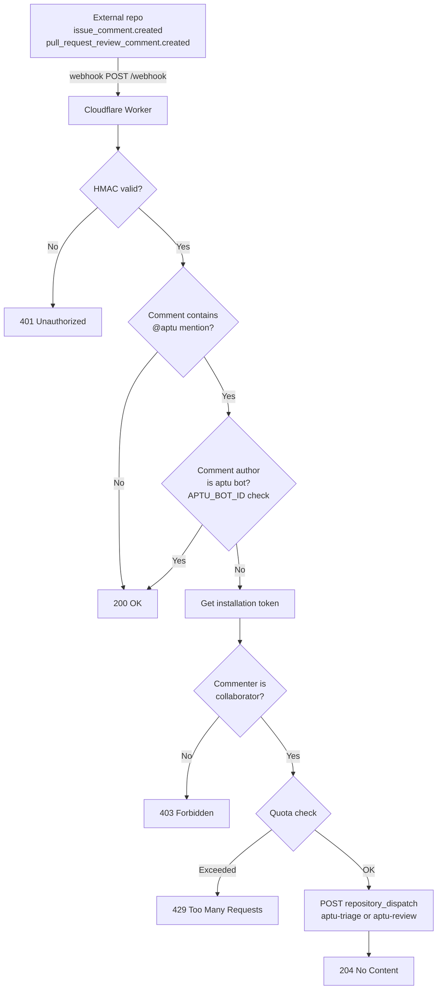

# Architecture

## Overview

aptu-github-app is a hosted automation service that brings AI-assisted issue triage and PR
review to any GitHub repository. It consists of two components that live in this repository:
a stateless Cloudflare Worker that receives GitHub webhooks and dispatches events, and a pair
of GitHub Actions workflows that consume those events and invoke the aptu CLI.

External repositories install the GitHub App and add a `.github/aptu.yml` opt-in config.
The Worker dispatches events to the caller's workflows, which run in the caller's context.

## Components

### Cloudflare Worker (`worker/src/index.ts`)

Deployed to `aptu.dev/webhook`. Receives every GitHub webhook event delivered by the App
installation. Responsibilities:

- Validate the `X-Hub-Signature-256` HMAC signature using the Web Crypto API
- Deduplicate replay deliveries via the `ReplayGuard` Durable Object (atomic check-and-record
  of `X-GitHub-Delivery`; returns 202 on duplicate)
- Validate the source IP against GitHub's published webhook IP ranges (fail-open; cached for
  3600 seconds)
- Enforce per-installation quota via the `InstallationQuota` Durable Object (500 events per
  event type per 24-hour rolling window; responds 429 with `Retry-After` on excess; enforced
  for all installations regardless of AI config, except the operator's own org -- see
  `OPERATOR_ORG` below)
- Obtain per-operation scoped installation tokens via `@octokit/auth-app` with minimum
  required permissions for each operation (config read, triage, review, scan, dispatch)
- Fetch and validate `.github/aptu.yml` from the originating repository (5-second timeout;
  no dispatch if absent or invalid)
- Evaluate `review.paths` globs (picomatch) against PR file lists; suppress dispatch if no
  file qualifies
- Obtain a scoped dispatch token for the originating repository
- Provision the standard dispatch handler workflows on `installation.created` and
  `installation_repositories.added` events when the App has Contents and Workflows write
  permissions; existing workflow files are never overwritten
- POST a `repository_dispatch` event to the originating repository, carrying all context in
  `client_payload`
- Return 200/204 to GitHub immediately; all processing is fire-and-forget after dispatch

The Worker is stateless beyond the Durable Object quota store. It never calls the aptu CLI
and has no knowledge of AI providers.

### GitHub Actions Workflows

The caller's `.github/workflows/aptu-{review,triage,scan-security}.yml` handlers listen for
their respective `repository_dispatch` event types fired by the Worker and call reusable
workflows hosted in `clouatre-labs/aptu-github-app`. The
reusable workflows run the aptu CLI using the caller's `GITHUB_TOKEN` and caller-provided AI
API key secret.

| Workflow | Trigger event type | aptu command |
| --- | --- | --- |
| `issue-triage.yml` | `aptu-triage` | `aptu issue triage` |
| `pr-review.yml` | `aptu-review` | `aptu pr review` |

The reusable workflows are defined in this repository (`clouatre-labs/aptu-github-app`) but
run in the originating repository's context. The originating repo, PR or issue number, and
installation ID arrive via `github.event.client_payload`. The aptu CLI runs with the caller's
`GITHUB_TOKEN` (scoped to the caller's repository by GitHub Actions) to read the originating
repo and post review comments or labels.

### `InstallationQuota` Durable Object (`worker/src/quota.ts`)

Persists per-installation event counters using Cloudflare Durable Object SQLite-backed
storage. Each counter is keyed by `quota:{installationId}:{eventType}`. On every request,
timestamps older than 24 hours are pruned. At `QUOTA_LIMIT` (500) events within the rolling
window the Durable Object returns `exceeded: true` and a `retryAfter` value in seconds.

#### Operator Org Exemption

`aptu-dev` has exactly one GitHub App installation, covering the entire `clouatre-labs` org
(`repository_selection: "all"`). Because the quota key is `installationId`-only with no
per-repo dimension, that single installation means quota is a de facto **org-wide** bucket
across every clouatre-labs repo combined, not per-repo -- a normal day of active development
across several repos can exhaust it. Decision (2026-08-24): the Worker checks `owner ===
env.OPERATOR_ORG` (`clouatre-labs`, set in `worker/wrangler.toml`) before every quota
check/record call and skips both entirely for the operator's own org. Quota's remaining
purpose -- after BYOK removed the shared-AI-key-cost rationale for it -- is abuse protection
for untrusted external installations, which doesn't apply to the operator's own repos.

There is still no org-wide aggregate *spend* ceiling (Durable Objects usage-based billing);
this is an accepted gap at the current scale, mitigated by the Cloudflare account-level Budget
Alert dashboard setting (no API exists to configure this programmatically) rather than
application logic. Revisit both the exemption and the spend gap before `aptu-dev` is ever
installed on an org other than `clouatre-labs`.

### Config Parser (`worker/src/config.ts`)

`fetchRepoConfig` fetches `.github/aptu.yml` from the originating repository via the GitHub
Contents API and decodes the base64 response. `parseConfig` validates the YAML strictly: all
required fields must be present and correctly typed; unknown fields are ignored; a partial or
empty `ai` block -- missing or empty `provider` or `model` -- causes the entire config to be
rejected. `shouldDispatch` checks whether the resolved config enables the requested feature
(`triage` or `review`).

## Data Flow

### Automatic triage and review (webhook trigger)


### Workflow provisioning (installation trigger)

When a GitHub App installation is created or repositories are added, the Worker obtains a
scoped Contents and Workflows write token, checks each standard dispatch handler path, and
creates only missing workflow files from the canonical sources. Deleted or removed events are
no-ops, and individual repository or file failures do not prevent the remaining batch.

### Mention command trigger (`@aptu` in comments)



## Token Model

Every webhook event uses per-operation scoped installation tokens issued by the GitHub App
via `@octokit/auth-app`. Each token is scoped to the originating repository with the minimum
permissions required for its operation.

| Token | Permissions | Purpose |
| --- | --- | --- |
| Config token | `contents:read`, `pull_requests:read` | Fetch `.github/aptu.yml`, fetch PR file list, check collaborator permission |
| Dispatch token | `contents:write` | Scoped to originating repo; calls `POST /repos/{originating_repo}/dispatches` |
| Triage token | `contents:read`, `issues:write` | Scoped to originating repo; forwarded via `client_payload.installation_token` for issue triage |
| Review token | `contents:read`, `pull_requests:write` | Scoped to originating repo; forwarded via `client_payload.installation_token` for PR review |
| Scan token | `contents:read`, `security_events:write`, `statuses:write` | Scoped to originating repo; forwarded via `client_payload.installation_token` for security scan |

All tokens are short-lived (1 hour, GitHub default). The Worker mints operation-scoped tokens
(triage, review, scan) and forwards them via `client_payload.installation_token`. Caller handlers
map this token into a `secrets:` block on the reusable workflow call. Reusable workflows receive
the installation token from the Worker via the caller handler's `secrets:` block (not inputs,
ensuring log masking). The Worker passes `ai_provider` and `ai_model` in the `client_payload`;
the AI API key is resolved by the caller's workflow from the caller's own repository secrets.

### Replay Deduplication

A `ReplayGuard` Durable Object provides atomic check-and-record deduplication of
`X-GitHub-Delivery` IDs. After HMAC validation and before JSON parsing, the Worker checks
the delivery ID against the DO. Duplicate deliveries receive a `202 Accepted` response
without dispatching a workflow. Delivery IDs expire after 300 seconds of inactivity.

### IP Validation

The Worker validates the `CF-Connecting-IP` header against GitHub's published webhook IP
ranges (fetched from `https://api.github.com/meta` and cached for 3600 seconds). Requests
from IPs outside the published hooks list receive a `403 Forbidden`. The check fails open:
if `/meta` is unavailable or `CF-Connecting-IP` is missing, the request proceeds with a
warning.

## Operational Prerequisites

The following GitHub variables and secrets must be provisioned before the app can handle
webhook events or run workflows:

| Name | Type | Scope | Value |
| --- | --- | --- | --- |
| `APP_ID` | Repository variable | `aptu-github-app` | GitHub App numeric ID |
| `APP_PRIVATE_KEY` | Repository secret | `aptu-github-app` | PKCS#8 PEM private key for the `aptu-dev` App |

## Configuration

### Worker environment (`wrangler.toml`)

| Variable | Type | Description |
| --- | --- | --- |
| `APP_ID` | var | GitHub App numeric ID |
| `APTU_BOT_ID` | var | GitHub numeric user ID of the `aptu[bot]` account; gates the self-mention loop guard |
| `WEBHOOK_SECRET` | secret | HMAC key matching the GitHub App webhook secret |
| `APP_PRIVATE_KEY` | secret | PKCS#8 PEM private key for the GitHub App; used by Worker to mint installation tokens |
| `QUOTA` | Durable Object binding | `InstallationQuota` namespace |
| `REPLAY_GUARD` | Durable Object binding | `ReplayGuard` namespace |

### Repository opt-in (`.github/aptu.yml`)

Each originating repository opts in by adding `.github/aptu.yml`. The Worker fetches this
file on every event; no dispatch occurs if it is absent or fails validation.

```yaml
version: 1

triage:
  enabled: true

review:
  enabled: true
  instructions-file: .github/instructions/pr-review.md  # optional
  skip-labeled: false                                     # optional
  paths:                                          # optional; suppress PR review when no file qualifies
    - "src/**"                                    # bare patterns are includes
    - "!src/data/**"                              # '!'-prefixed patterns are excludes

ai:                          # optional
  provider: openrouter
  model: google/gemma-4-26b-a4b-it
```

When the `ai` block is configured, the dispatch payload carries `ai_provider` and `ai_model`.
The caller's static dispatch handler derives which repository secret to use from
`ai_provider` via a static mapping (`anthropic` -> `secrets.ANTHROPIC_API_KEY`, `gemini` ->
`secrets.GEMINI_API_KEY`, otherwise `secrets.OPENROUTER_API_KEY`), resolved inside the
caller's own workflow run against the caller's own repository secrets. Every secret name in
that mapping is a fixed literal, not a caller-supplied string -- this avoids GitHub Actions'
requirement to provision the entire secrets context for a dynamically-computed secret key
(zizmor's `overprovisioned-secrets` audit).

## Caller-Supplied AI Keys (BYOK)

The BYOK (bring your own key) model allows each installation to use its own AI API key. The
caller installs the `.github/workflows/aptu-{review,triage,scan-security}.yml` handlers in
their repository, each of which receives its own `repository_dispatch` event type from the
Worker and calls a reusable workflow hosted in `clouatre-labs/aptu-github-app`. The caller's
static dispatch handlers pick one of three fixed repository secrets (`ANTHROPIC_API_KEY`,
`GEMINI_API_KEY`, `OPENROUTER_API_KEY`) based on the `ai_provider` value in the dispatch
payload, and pass the resolved secret to the reusable workflow via the `secrets:` block. No
installer ever hand-edits a workflow file to reference
a specific secret name -- they only need to name their own repository secret after their
chosen provider's canonical env var.

The reusable workflow runs in the caller's context: it receives the operation-scoped installation
token from the Worker via the caller handler's `secrets:` block (scoped to the caller's repository
with minimal permissions for that specific operation), and the AI API key is resolved from the
caller's repository secrets. The operator's AI keys and `APP_PRIVATE_KEY` are never accessible to
the reusable workflow (GitHub Actions reusable workflows can only access secrets from the calling
repository, not the defining repository).

The AI API key secret value never passes through the Worker or the webhook dispatch payload
(it is resolved caller-side); only the provider name (`ai_provider`) passes through, and only
one of three fixed secret names is ever referenced by the workflow. The caller must create the
correspondingly-named secret in their own repository. In contrast, the operation-scoped
installation token is intentionally forwarded via `client_payload.installation_token` by the
Worker and mapped directly into the reusable workflow's `secrets:` block by the caller handler.

## Security Boundaries

| Boundary | Mechanism |
| --- | --- |
| Webhook authenticity | HMAC-SHA256 via Web Crypto API; `WEBHOOK_SECRET` never leaves the Worker |
| Token isolation | Installation tokens are minted by the Worker scoped per-repo; dispatch tokens are scoped to the originating repo |
| Quota enforcement | Durable Object per installation; 500 events per event type per 24h rolling window; enforced for all installations regardless of AI config, except the operator's own org (`OPERATOR_ORG`) |
| Caller AI keys | BYOK: caller provides AI API key via a repository secret in their own repo, named after the provider selected via `ai.provider` in their own `.github/aptu.yml` (`ANTHROPIC_API_KEY` / `GEMINI_API_KEY` / `OPENROUTER_API_KEY`); the dispatch handler statically selects one of these three fixed names per-dispatch and passes the secret to the reusable workflow via `secrets:`; operator keys never exposed |
| Config validation | Strict field-level validation; unknown keys ignored; partial blocks rejected |
| Self-mention loop | `APTU_BOT_ID` check prevents the bot from triggering itself via `@aptu` |
| Path filtering | `review.paths` evaluated against full PR file list before dispatch |

## Key Abstractions

### `validateSignature`

Verifies `X-Hub-Signature-256` using `crypto.subtle.verify` (HMAC-SHA256). Called first on
every request before any payload is parsed.

### `checkQuota`

Enforces per-installation quota by delegating to the `InstallationQuota` Durable Object
via a request to `https://quota/quota`. Returns a `Response` to short-circuit the handler if
quota is exceeded or the check fails, or `null` to continue.

### `shouldSkipPrDispatch`

Fetches the PR file list from the GitHub API and applies `review.paths` patterns using
`shouldSkipByPathFilters` (picomatch `isMatch`). Returns `true` (skip) only when no file
in the PR qualifies for review: a file qualifies when it matches an include pattern (if any
includes are configured) and does not match any exclude pattern. With no `review.paths`, it
returns `false` immediately without an HTTP call.

### `handleMentionCommand`

Detects `@aptu` in comment bodies (stripping code blocks before matching), verifies the
commenter is a repository collaborator, enforces quota, then dispatches the appropriate
event. The `APTU_BOT_ID` check at entry prevents the bot's own review comments from
re-triggering triage or review.

### `fetchRepoConfig` / `parseConfig`

`fetchRepoConfig` calls the GitHub Contents API with a 5-second timeout. `parseConfig`
decodes the base64 body, runs strict field-level YAML validation, and returns `null` on any
parse or validation failure.

## Deployment

Merging to `main` triggers `deploy.yml`, which runs `bunx wrangler deploy` via the `deploy` script in `worker/package.json` to deploy
the Worker. Required secrets and variables:

- `CLOUDFLARE_API_TOKEN` (GitHub Actions secret)
- `CLOUDFLARE_ACCOUNT_ID` (GitHub Actions variable)
- `WEBHOOK_SECRET` (Wrangler secret, set via `bunx wrangler secret put`)
- `APP_PRIVATE_KEY` (Wrangler secret, PKCS#8 PEM format)

The Worker route `aptu.dev/webhook` requires a proxied `AAAA 100::` DNS record on the
`aptu.dev` zone; without it the domain does not resolve and GitHub cannot deliver webhooks.

## Testing

Tests live in `worker/src/index.test.ts` and run via Vitest (`bun test`). CI enforces lint
(Biome), type check (TypeScript), and tests before merge. The `InstallationQuota` Durable
Object is mocked via a `DurableObjectStub` test double. All checks must pass; the `CI
Result` job is the sole required status check in the branch ruleset.
