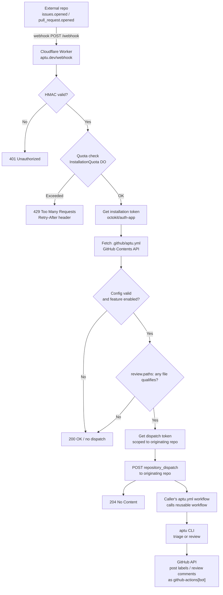
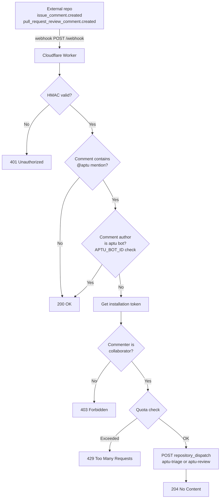

# Architecture

## Overview

aptu-github-app is a hosted automation service that brings AI-assisted issue triage and PR
review to any GitHub repository. It consists of two components that live in this repository:
a stateless Cloudflare Worker that receives GitHub webhooks and dispatches events, and a pair
of GitHub Actions workflows that consume those events and invoke the aptu CLI.

External repositories never run workflows themselves. They install the GitHub App, add a
`.github/aptu.yml` opt-in config, and all processing happens centrally here.

## Components

### Cloudflare Worker (`worker/src/index.ts`)

Deployed to `aptu.dev/webhook`. Receives every GitHub webhook event delivered by the App
installation. Responsibilities:

- Validate the `X-Hub-Signature-256` HMAC signature using the Web Crypto API
- Deduplicate replay deliveries via the `ReplayGuard` Durable Object (atomic check-and-record
  of `X-GitHub-Delivery`; returns 202 on duplicate)
- Validate the source IP against GitHub's published webhook IP ranges (fail-open; cached for
  3600 seconds)
- Enforce per-installation quota via the `InstallationQuota` Durable Object (50 events per
  event type per 24-hour rolling window; responds 429 with `Retry-After` on excess; enforced
  for all installations regardless of AI config)
- Obtain per-operation scoped installation tokens via `@octokit/auth-app` with minimum
  required permissions for each operation (config read, triage, review, scan, dispatch)
- Fetch and validate `.github/aptu.yml` from the originating repository (5-second timeout;
  no dispatch if absent or invalid)
- Evaluate `review.paths` globs (picomatch) against PR file lists; suppress dispatch if no
  file qualifies
- Obtain a scoped dispatch token for the originating repository
- POST a `repository_dispatch` event to the originating repository, carrying all context in
  `client_payload`
- Return 200/204 to GitHub immediately; all processing is fire-and-forget after dispatch

The Worker is stateless beyond the Durable Object quota store. It never calls the aptu CLI
and has no knowledge of AI providers.

### GitHub Actions Workflows

The caller's `.github/workflows/aptu.yml` listens for `repository_dispatch` events fired by
the Worker and calls reusable workflows hosted in `clouatre-labs/aptu-github-app`. The
reusable workflows run the aptu CLI using the caller's `GITHUB_TOKEN` and caller-provided AI
API key secret.

| Workflow | Trigger event type | aptu command |
| --- | --- | --- |
| `issue-triage.yml` | `aptu-triage` | `aptu issue triage` |
| `pr-review.yml` | `aptu-review` | `aptu pr review` |

Both workflows run in this repository (`clouatre-labs/aptu-github-app`), not in the
originating repository. The originating repo, PR or issue number, and installation ID
arrive via `github.event.client_payload`. Workflows mint scoped installation tokens via
`actions/create-github-app-token` using the App ID and private key stored in this repository,
and the aptu CLI uses that token to read the originating repo and post review comments or
labels back to it.

### `InstallationQuota` Durable Object (`worker/src/quota.ts`)

Persists per-installation event counters using Cloudflare Durable Object SQLite-backed
storage. Each counter is keyed by `quota:{installationId}:{eventType}`. On every request,
timestamps older than 24 hours are pruned. At 50 events within the rolling window the Durable
Object returns `exceeded: true` and a `retryAfter` value in seconds.

### `GlobalQuota` Durable Object (`worker/src/quota.ts`)

Persists an org-wide aggregate event counter using a single well-known Durable Object
instance (`idFromName('global')`). The limit is passed in the Request body (the DO has no
`env` access) and is coerced from `GLOBAL_QUOTA_LIMIT` with a default of 500/day. The
counter uses the same rolling 24-hour window and pruning logic as `InstallationQuota`.

### Config Parser (`worker/src/config.ts`)

`fetchRepoConfig` fetches `.github/aptu.yml` from the originating repository via the GitHub
Contents API and decodes the base64 response. `parseConfig` validates the YAML strictly: all
required fields must be present and correctly typed; unknown fields are ignored; a partial or
empty `ai` block -- missing or empty `provider` or `model` -- causes the entire config to be
rejected. `shouldDispatch` checks whether the resolved config enables the requested feature
(`triage` or `review`).

## Data Flow

### Automatic triage and review (webhook trigger)



### Mention command trigger (`@aptu` in comments)



## Token Model

Every webhook event uses per-operation scoped installation tokens issued by the GitHub App
via `@octokit/auth-app`. Each token is scoped to the originating repository with the minimum
permissions required for its operation.

| Token | Permissions | Purpose |
| --- | --- | --- |
| Config token | `contents:read`, `pull_requests:read` | Fetch `.github/aptu.yml`, fetch PR file list, check collaborator permission |
| Dispatch token | `contents:write` | Scoped to originating repo; calls `POST /repos/{originating_repo}/dispatches` |

All tokens are short-lived (1 hour, GitHub default). The Worker mints only config and dispatch
tokens. Operation tokens are not needed: reusable workflows use the caller's `GITHUB_TOKEN`
(scoped to the caller's repository by GitHub Actions). The Worker passes `ai_provider` and
`ai_model` in the `client_payload`; the AI API key is resolved by the caller's workflow from
the caller's own repository secrets.

### Replay Deduplication

A `ReplayGuard` Durable Object provides atomic check-and-record deduplication of
`X-GitHub-Delivery` IDs. After HMAC validation and before JSON parsing, the Worker checks
the delivery ID against the DO. Duplicate deliveries receive a `202 Accepted` response
without dispatching a workflow. Delivery IDs expire after 300 seconds of inactivity.

### IP Validation

The Worker validates the `CF-Connecting-IP` header against GitHub's published webhook IP
ranges (fetched from `https://api.github.com/meta` and cached for 3600 seconds). Requests
from IPs outside the published hooks list receive a `403 Forbidden`. The check fails open:
if `/meta` is unavailable or `CF-Connecting-IP` is missing, the request proceeds with a
warning.

## Operational Prerequisites

The following GitHub variables and secrets must be provisioned before the app can handle
webhook events or run workflows:

| Name | Type | Scope | Value |
| --- | --- | --- | --- |
| `APP_ID` | Repository variable | `aptu-github-app` | GitHub App numeric ID |
| `APP_PRIVATE_KEY` | Repository secret | `aptu-github-app` | PKCS#1 PEM private key for the `aptu-dev` App |
| `OPENROUTER_API_KEY` | Organization secret | `clouatre-labs` | OpenRouter API key |

## Configuration

### Worker environment (`wrangler.toml`)

| Variable | Type | Description |
| --- | --- | --- |
| `APP_ID` | var | GitHub App numeric ID |
| `APTU_BOT_ID` | var | GitHub numeric user ID of the `aptu[bot]` account; gates the self-mention loop guard |
| `WEBHOOK_SECRET` | secret | HMAC key matching the GitHub App webhook secret |
| `APP_PRIVATE_KEY` | secret | PKCS#8 PEM private key for the GitHub App; used by Worker to mint installation tokens |
| `QUOTA` | Durable Object binding | `InstallationQuota` namespace |
| `REPLAY_GUARD` | Durable Object binding | `ReplayGuard` namespace |

### Repository opt-in (`.github/aptu.yml`)

Each originating repository opts in by adding `.github/aptu.yml`. The Worker fetches this
file on every event; no dispatch occurs if it is absent or fails validation.

```yaml
version: 1

triage:
  enabled: true

review:
  enabled: true
  instructions-file: .github/instructions/pr-review.md  # optional
  skip-labeled: false                                     # optional
  paths:                                          # optional; suppress PR review when no file qualifies
    - "src/**"                                    # bare patterns are includes
    - "!src/data/**"                              # '!'-prefixed patterns are excludes

ai:                          # optional
  provider: openrouter
  model: google/gemma-4-26b-a4b-it
```

When the `ai` block is configured, the dispatch payload carries `ai_provider` and `ai_model`.
The caller's static dispatch handler derives which repository secret to use from
`ai_provider` via a static mapping (`anthropic` -> `secrets.ANTHROPIC_API_KEY`, `gemini` ->
`secrets.GEMINI_API_KEY`, otherwise `secrets.OPENROUTER_API_KEY`), resolved inside the
caller's own workflow run against the caller's own repository secrets. Every secret name in
that mapping is a fixed literal, not a caller-supplied string -- this avoids GitHub Actions'
requirement to provision the entire secrets context for a dynamically-computed secret key
(zizmor's `overprovisioned-secrets` audit).

## Caller-Supplied AI Keys (BYOK)

The BYOK (bring your own key) model allows each installation to use its own AI API key. The
caller installs `.github/workflows/aptu.yml` in their repository, which receives
`repository_dispatch` events from the Worker and calls reusable workflows hosted in
`clouatre-labs/aptu-github-app`. The caller's static dispatch handler picks one of three fixed
repository secrets (`ANTHROPIC_API_KEY`, `GEMINI_API_KEY`, `OPENROUTER_API_KEY`) based on the
`ai_provider` value in the dispatch payload, and passes the resolved secret to the reusable
workflow via the `secrets:` block. No installer ever hand-edits the workflow file to reference
a specific secret name -- they only need to name their own repository secret after their
chosen provider's canonical env var.

The reusable workflow runs in the caller's context: `GITHUB_TOKEN` is scoped to the caller's
repository, and the AI API key is resolved from the caller's repository secrets. The operator's
AI keys and `APP_PRIVATE_KEY` are never accessible to the reusable workflow (GitHub Actions
reusable workflows can only access secrets from the calling repository, not the defining
repository).

The secret value never passes through the Worker or the webhook dispatch payload; only the
provider name (`ai_provider`) passes through, and only one of three fixed secret names is ever
referenced by the workflow. The caller must create the correspondingly-named secret in their
own repository.

## Security Boundaries

| Boundary | Mechanism |
| --- | --- |
| Webhook authenticity | HMAC-SHA256 via Web Crypto API; `WEBHOOK_SECRET` never leaves the Worker |
| Token isolation | Installation tokens are minted by the Worker scoped per-repo; dispatch tokens are scoped to the originating repo |
| Quota enforcement | Durable Object per installation; 50 events per event type per 24h rolling window; enforced for all installations regardless of AI config |
| Caller AI keys | BYOK: caller provides AI API key via a repository secret in their own repo, named after the provider selected via `ai.provider` in their own `.github/aptu.yml` (`ANTHROPIC_API_KEY` / `GEMINI_API_KEY` / `OPENROUTER_API_KEY`); the dispatch handler statically selects one of these three fixed names per-dispatch and passes the secret to the reusable workflow via `secrets:`; operator keys never exposed |
| Config validation | Strict field-level validation; unknown keys ignored; partial blocks rejected |
| Self-mention loop | `APTU_BOT_ID` check prevents the bot from triggering itself via `@aptu` |
| Path filtering | `review.paths` evaluated against full PR file list before dispatch |

## Key Abstractions

### `validateSignature`

Verifies `X-Hub-Signature-256` using `crypto.subtle.verify` (HMAC-SHA256). Called first on
every request before any payload is parsed.

### `enforceQuota` / `checkQuota`

Enforces a two-level quota model. `enforceQuota` first calls `checkGlobalQuota`, which
delegates to the `GlobalQuota` Durable Object via an internal `POST /quota` fetch. A failing
(500) global check short-circuits before the per-installation check. If the org-wide quota is
within its ceiling, `checkQuota` then delegates to the `InstallationQuota` Durable Object.
Returns a `Response` to short-circuit the handler if either quota is exceeded or fails, or
`null` to continue.

### `shouldSkipPrDispatch`

Fetches the PR file list from the GitHub API and applies `review.paths` patterns using
`shouldSkipByPathFilters` (picomatch `isMatch`). Returns `true` (skip) only when no file
in the PR qualifies for review: a file qualifies when it matches an include pattern (if any
includes are configured) and does not match any exclude pattern. With no `review.paths`, it
returns `false` immediately without an HTTP call.

### `handleMentionCommand`

Detects `@aptu` in comment bodies (stripping code blocks before matching), verifies the
commenter is a repository collaborator, enforces quota, then dispatches the appropriate
event. The `APTU_BOT_ID` check at entry prevents the bot's own review comments from
re-triggering triage or review.

### `fetchRepoConfig` / `parseConfig`

`fetchRepoConfig` calls the GitHub Contents API with a 5-second timeout. `parseConfig`
decodes the base64 body, runs strict field-level YAML validation, and returns `null` on any
parse or validation failure.

## Deployment

Merging to `main` triggers `deploy.yml`, which runs `bunx wrangler deploy` via the `deploy` script in `worker/package.json` to deploy
the Worker. Required secrets and variables:

- `CLOUDFLARE_API_TOKEN` (GitHub Actions secret)
- `CLOUDFLARE_ACCOUNT_ID` (GitHub Actions variable)
- `WEBHOOK_SECRET` (Wrangler secret, set via `bunx wrangler secret put`)
- `APP_PRIVATE_KEY` (Wrangler secret, PKCS#1 PEM format)

The Worker route `aptu.dev/webhook` requires a proxied `AAAA 100::` DNS record on the
`aptu.dev` zone; without it the domain does not resolve and GitHub cannot deliver webhooks.

## Testing

Tests live in `worker/src/index.test.ts` and run via Vitest (`bun test`). CI enforces lint
(Biome), type check (TypeScript), and tests before merge. The `InstallationQuota` Durable
Object is mocked via a `DurableObjectStub` test double. All checks must pass; the `CI
Result` job is the sole required status check in the branch ruleset.
