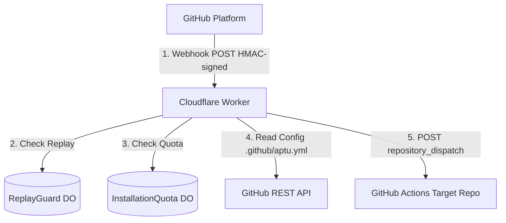
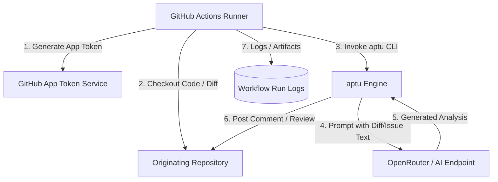
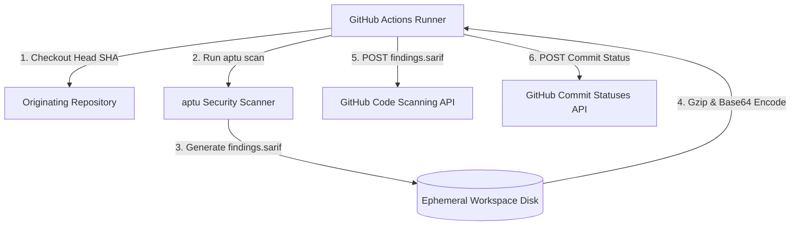

# Data Flow and System Inventory

This document details the lifecycle and movement of customer and operational data across **aptu-github-app**, illustrating component boundaries, protocols, retention spans, and store classifications.

---

## 1. High-Level Data Flow Diagrams

### A. Webhook Ingestion & Worker Dispatch

1. **GitHub Webhook Delivery**: GitHub sends an HMAC-signed payload containing issue, PR, or comment metadata to `aptu.dev/webhook`.
2. **Replay Validation**: The Worker invokes `ReplayGuard` Durable Object to ensure `X-GitHub-Delivery` has not been processed within 24 hours.
3. **Quota Check**: The Worker checks `InstallationQuota` Durable Object to enforce the rate limit (50 requests / 24 hours) unless custom AI credentials are provided.
4. **Config Fetch**: The Worker requests `.github/aptu.yml` using a short-lived token to parse triage, review, or scan configuration.
5. **Event Dispatch**: The Worker calls GitHub's `repository_dispatch` endpoint with a structured `client_payload` and terminates the request with HTTP 200/204.

---

### B. GitHub Actions Execution & AI Inference Flow

1. **Token Generation**: Runner requests an installation token with scoped permissions (`permission-contents: read`, `permission-issues: write` or `permission-pull-requests: write`).
2. **Context Retrieval**: Runner checks out the repository or queries diff data for the target pull request or issue.
3. **Execution**: `aptu` action prepares analysis prompts within character limits (`max-prompt-chars: 200000`).
4. **Inference**: Prompt containing code diffs or issue text is sent over HTTPS to the configured AI provider via OpenRouter.
5. **Output Delivery**: Results are formatted and posted directly back to the originating pull request or issue.
6. **Log Archival**: Terminal logs are retained according to workflow retention policy.

---

### C. Security Scanning & SARIF Flow (`scan-security.yml`)

1. **Checkout**: Originating repository is checked out at `head_sha`.
2. **Scan**: The scanner evaluates codebase rules and emits `findings.sarif` to the local runner filesystem.
3. **Upload**: SARIF output is gzipped, base64-encoded, and uploaded to `repos/{repo}/code-scanning/sarifs`.
4. **Status Check**: Workflow reports conclusion (`success` or `failure`) to GitHub Commit Statuses API (`aptu-scan-security`).

---

## 2. Processing Location and Data Store Inventory

The following table categorizes every store, storage tier, access boundary, and retention rule across the architecture:

| Processing Location / Store | Data Categories Stored | Access Controls & Encryption | Retention Period | Deletion Mechanism |
| :--- | :--- | :--- | :--- | :--- |
| **Cloudflare Worker Edge Memory** | Webhook headers, event JSON, payload fragments | In-memory only; encrypted in transit via TLS 1.3 | Ephemeral (execution duration < 50ms) | Garbage collected upon worker execution completion |
| **Cloudflare `ReplayGuard` (Durable Object)** | `X-GitHub-Delivery` UUIDs and timestamps | Cloudflare DO encrypted storage; restricted to Worker binding | Rolling 24-hour window | Automatic record purging during lookups and after 24 hours |
| **Cloudflare `InstallationQuota` (Durable Object)** | Installation IDs, event types, operation timestamps | Cloudflare DO encrypted storage; restricted to Worker binding | Rolling 24-hour window | Pruned on check/record calls after timestamp exceeds 24 hours |
| **GitHub Actions Runner Disk (`ubuntu-24.04-arm`)** | Full repository clone (for security scan), PR diffs, instructions files, temporary SARIF files | Ephemeral VM disk isolation; encrypted at rest by GitHub/Azure | Ephemeral (duration of workflow run, max 10 min) | Discarded automatically when runner VM is terminated |
| **GitHub Actions Workflow Logs (`scan-security`)** | Execution steps, console output, exit codes, diagnostic summaries | GitHub access control (read permissions on target repository) | **7 days** | Hard operational retention limit (`retention-days: 7`) in workflow definition |
| **GitHub Actions Workflow Logs (`issue-triage`, `pr-review`, `ci`, `deploy`)** | Execution output, job step metadata | GitHub access control (read permissions on target repository) | **14 days** | Hard operational retention limit (`retention-days: 14`) in workflow definition |
| **GitHub Code Scanning (SARIF Store)** | Static analysis findings, rule IDs, file paths, line locations, possible code snippets | GitHub Repository Security permission model | Governed by repository / organization retention | Managed directly through GitHub repository administration settings |
| **Sentry Error Telemetry** | Exception traces, HTTP response errors, installation IDs | Sentry organization access control; TLS in transit | Up to 90 days | Managed via Sentry project retention policies |
| **OpenRouter / Upstream AI Providers** | Analysis prompts containing code diffs, issue descriptions, instructions | TLS in transit; governed by upstream provider data policies and API keys | Transient context; 0 to 30 days depending on provider ZDR status | Governed by AI provider policy and Zero Data Retention configurations |

---

## 3. Data Flow Guarantees and Limitations

1. **Worker Payload Bounding**: The Cloudflare Worker extracts only necessary routing keys (`installation_id`, `issue_number`, `originating_repo`) and truncates comment bodies to 4,000 characters for mention dispatches.
2. **No Repository Code in Worker**: The Worker never clones or holds repository git history. Code is fetched exclusively on GitHub Actions runners with short-lived App installation tokens.
3. **Workflow Retention Boundaries**: The `retention-days` setting strictly bounds GitHub Actions workflow logs. It does not control data retained in SARIF databases, Sentry errors, Cloudflare state, or AI provider logs.
4. **SARIF Code Snippet Verification**: Inspection of the underlying `aptu` action is required to verify whether source code snippets are included in `findings.sarif`.
5. **Residency and Routing**: Cloudflare Worker and GitHub Actions runners operate without regional geographic pinning; traffic is processed in regional nodes determined by Cloudflare and GitHub infrastructure.

For detailed privacy, rights, and compliance policies, refer to the [Privacy Policy](https://github.com/clouatre-labs/aptu-github-app/blob/main/docs/PRIVACY.md).
